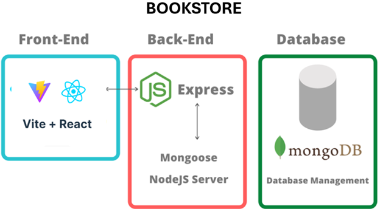
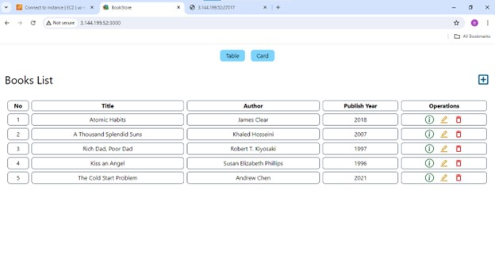
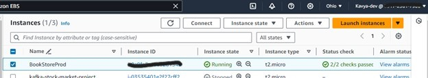
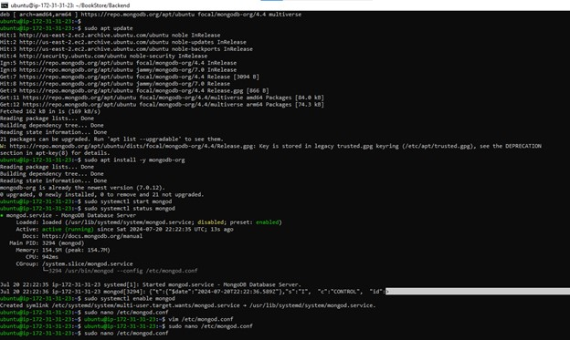
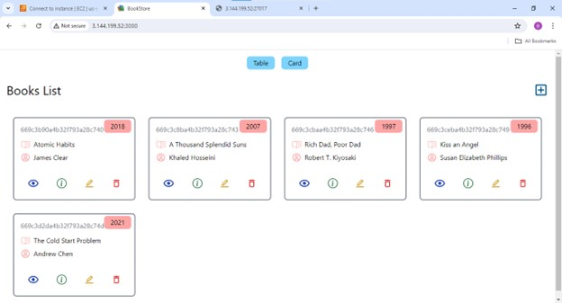

# BookStore App 

## Development
Created a Website to store details of books and perform create, delete and update operations.
Used different technologies such as Node js, Vite js, and Mongodb.

### Architecture 

### Run Application
- Frontend
cd Frontend -> npm run dev
- Backend
cd Backend -> npm run dev

### Terminal
- server with express.js
- npm init to create base .json file
- npm create vite -> instead of npm create-react-app

## Deployment
AWS EC2 offers a scalable and reliable infrastructure to host your application, ensuring its availability and performance.

### Step 1 (Creating EC2 Instance and connecting using ssh)
- Create an EC2 Instance (I created a Ubundu OS instance)first and then access it using SSH.
- Open the port no. 3000 in your security group (to access the frontend).

### Step 2 (Installing Required Items in Ubuntu)
- Node.js installation
1. sudo apt update
2. sudo apt install nodejs
3. nodejs -v
4. npm -v
- Mongodb Installation on Ubuntu EC2
1. sudo apt update (Update the package database)
2. wget -qO - https://www.mongodb.org/static/pgp/server-4.4.asc | sudo apt-key add - (Import the MongoDB public GPG key)
3. echo "deb [ arch=amd64,arm64 ] https://repo.mongodb.org/apt/ubuntu focal/mongodb-org/4.4 multiverse" | sudo tee /etc/apt/sources.list.d/mongodb-org-4.4.list (Create a list file for MongoDB)
4. sudo apt update (Reload the local package database)
5. sudo apt install -y mongodb-org (Install MongoDB packages)
6. sudo systemctl start mongod (Start MongoDB)
7. sudo systemctl status mongod (Verify that MongoDB has started)
8. sudo systemctl enable mongod (Enable MongoDB to start on boot)
- Install Git
1. sudo apt install git
2. git --version

### Step 3 (Clone project into EC2 server)
- git clone https://github.com/kavyabijja12/BookStore.git

### Step 4 (Install node dependencies)
- cd Frontend -> npm install
- cd Backend -> npm install

### Step 5 (Configure MongoDB)
By default, MongoDB listens on port 27017. You can configure MongoDB to allow remote connections if needed by editing the MongoDB configuration file.

1. sudo nano /etc/mongod.conf (Open the MongoDB configuration file)
2. Update the bindIp setting to allow connections from any IP address (optional):
   # network interfaces
   net:
     port: 27017
     bindIp: 0.0.0.0  # default is 127.0.0.1
3. sudo systemctl restart mongod (Restart MongoDB to apply changes)

### Step 6: Update Security Group for EC2
Ensure your EC2 instance’s security group allows inbound traffic on MongoDB’s default port (27017).
- Edit inbound rules to add a rule
   - Type: Custom TCP
   - Port Range: 27017
   - Source: (your IP, 0.0.0.0/0 for all IPs, or your VPC CIDR range)

### Step 7: Connect Your Application to MongoDB
In your MERN application's backend, configure the MongoDB connection (used mongoose in backend)
- Update your `default.json` configuration file:
   {
     "mongoURI": "mongodb://localhost:27017/yourdbname"
   }

### Step 8: Start Application
- cd Frontend -> npm install
- cd Backend -> npm install

### Optional: Secure MongoDB
For a production environment, you should secure your MongoDB instance with authentication and proper firewall rules to prevent unauthorized access. This can include setting up user roles and ensuring only specific IP addresses can connect to your MongoDB instance.

## Notes
- CORS Policy 
Cross-Origin Resource Sharing
It is a secure mechanism in web browsers that restricts unauthorized access 
- vite
Choosing between Vite and Create React App (CRA) is pivotal in 2024. While CRA offers simplicity and strong React support, Vite stands out for speed and flexibility. Vite's quick build and hot reloading, along with multi-framework support, make it ideal for larger projects.
- Tailwind CSS 
Working with Tailwind CSS encourages a more direct approach to styling. Instead of moving between HTML files and separate CSS stylesheets, developers can apply styles right within the HTML. This makes designing quicker and simpler. Tailwind CSS isn't tied to a specific JavaScript framework.
- Express is backend server
- nodemon is to restart server automatically when changes made

## Resources
- https://www.mongodb.com/docs/manual/tutorial/install-mongodb-on-ubuntu/
- https://mongoosejs.com/docs/connections.html/
- https://medium.com/@srijaanaparthy/step-by-step-guide-to-install-docker-on-amazon-linux-machine-in-aws-a690bf44b5fe
- https://www.mongodb.com/docs/manual/tutorial/install-mongodb-community-with-docker/

